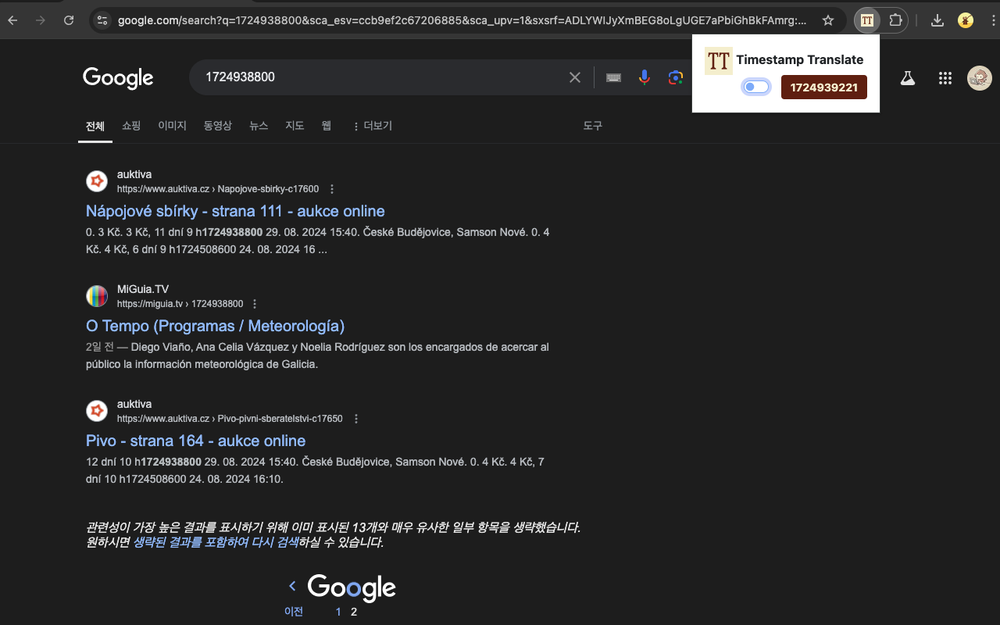
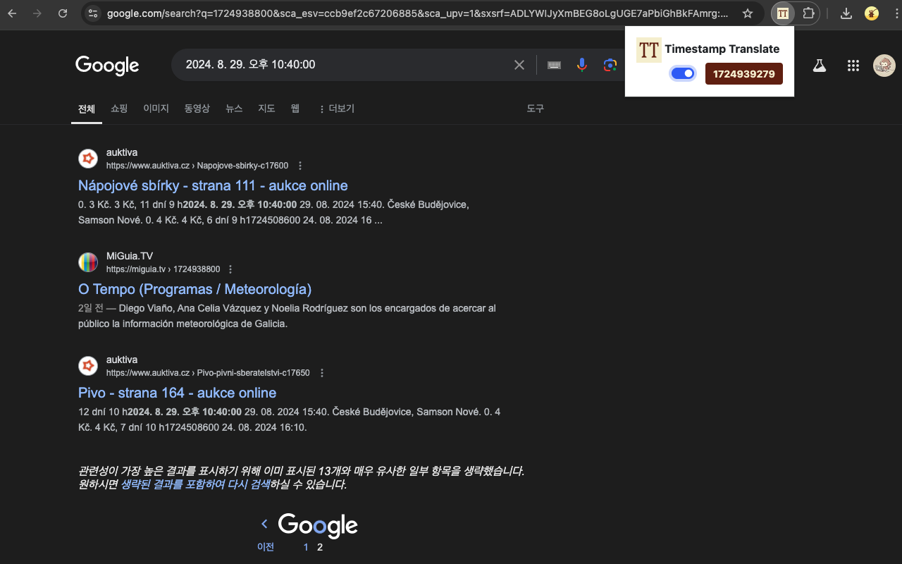

# timestamp-translate

> Unix timestamp to locale datetime converter
> 
> **`1725195347`** to **`2024. 9. 1. 오후 9:55:47`**
>
> https://chromewebstore.google.com/detail/timestamp-translate/cedgmddjhflbfijbcenbeabopfnklobf

|off|on|
|------|------|
|||
